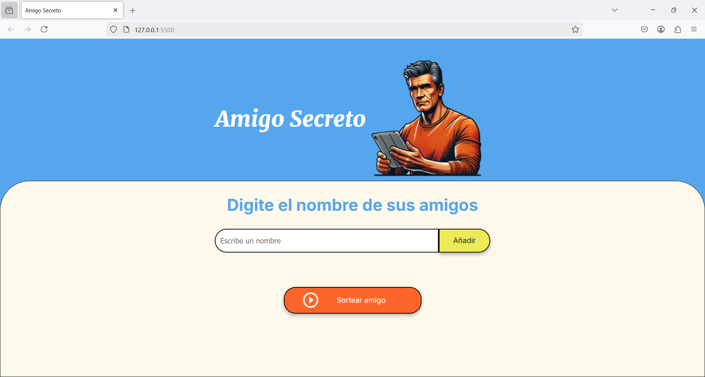
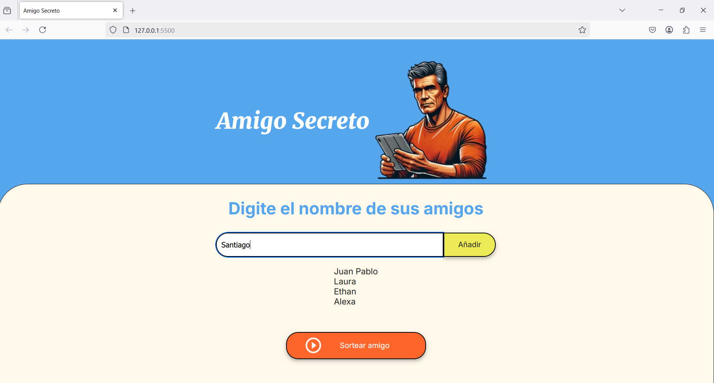
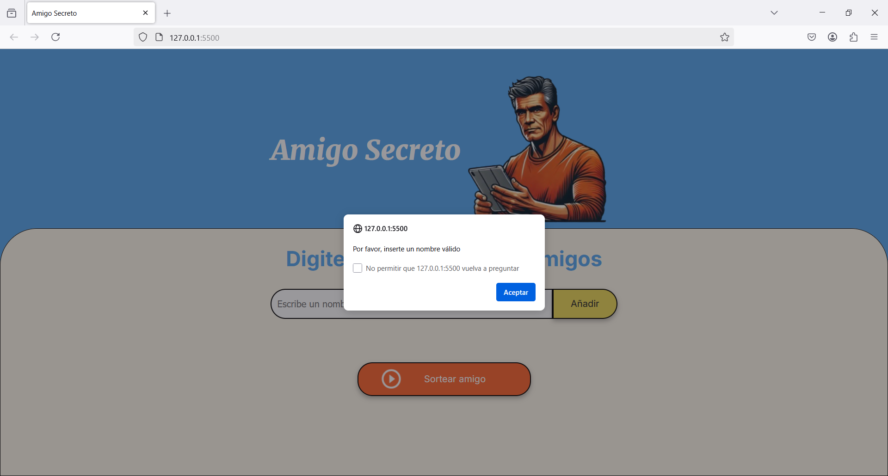
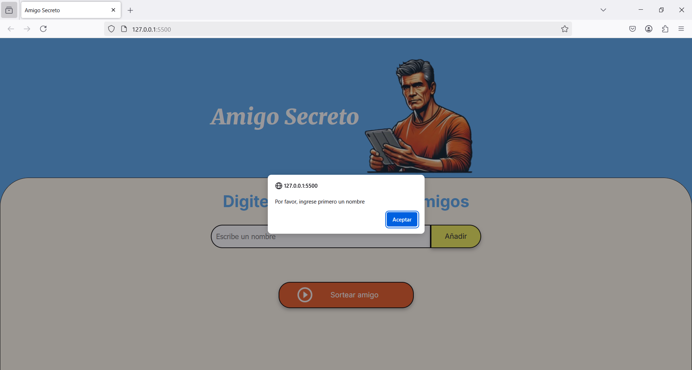

## Screenshots

# Aplicación Amigo Secreto

Para poder entender el proyecto se tiene un grupo de amigos que estan interesados en poder jugar al amigo secreto y para poder elegir aleatoriamente que amigo sacaba al otro, se dispusieron a realizar una aplicación que cumpliera con este proposito de elegir de manera al azar que amigo le toca endulzar, de este juego nacio la aplicación.

### Descripción del proyecto

Esta aplicación te permite hacer el sorteo del amigo secreto tanto de forma presencial como online. En el primer caso, la aplicación seleccionará una persona al azar. Esta tendrá que agregar el nombre de todas las personas involucradas en el boton ‘Añadir’ y debera proceder con seleccionar sobre el boton ‘Sortear amigo’, sin que nadie lo vea. Cuando lo haga, aparecerá el nombre sorteado dentro de la aplicación a la que tendrá que endulzar y hacer el regalo.

## Features

- **Agregar Nombre**: Los usuarios escribirán el nombre de un amigo en un campo de texto y lo agregarán a una lista visible al hacer clic en "Adicionar".
- **Validar Entrada**: Si el campo de texto está vacío, el programa mostrará una alerta pidiendo un nombre válido.
- **Visualizar la Lista**: Los nombres ingresados aparecerán en una lista debajo del campo de entrada.
- **Sorteo Aleatorio**: Al hacer clic en el botón "Sortear Amigo", se seleccionará aleatoriamente un nombre de la lista y se mostrará en la página.

## Cómo pueden usarlo los usuarios

El usuario podra encontrar el archivo HTML en el que al ejecutar se encontraran los siguientes apartados:

## Screenshoots

La interfaz en la que pueden interactura y agregar amigos:

El listado de amigos agregados:

Si no agregan un nombre saldra la ventana de aviso:

Y tambien saldra una ventana de aviso si quieren sortear sin ningun nombre agregado a la lista:

## Donde los usuarios pueden encontrar ayuda sobre su proyecto

Podran descargar los archivos que se requieren para poder trabajar con el aplicativo:

desde el siguiente link:

https://github.com/DavidCaicedoSTA18/challenge-amigo-secreto-david-caicedo/tree/main

## Tech Stack

**Frontend:** HTML, CSS, JavaScript

## Authors

- [@DavidCaicedoSTA18](https://github.com/DavidCaicedoSTA18/challenge-amigo-secreto-david-caicedo)

